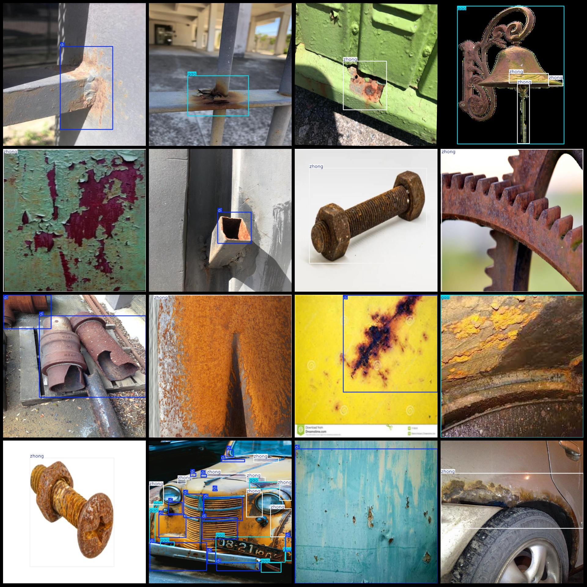
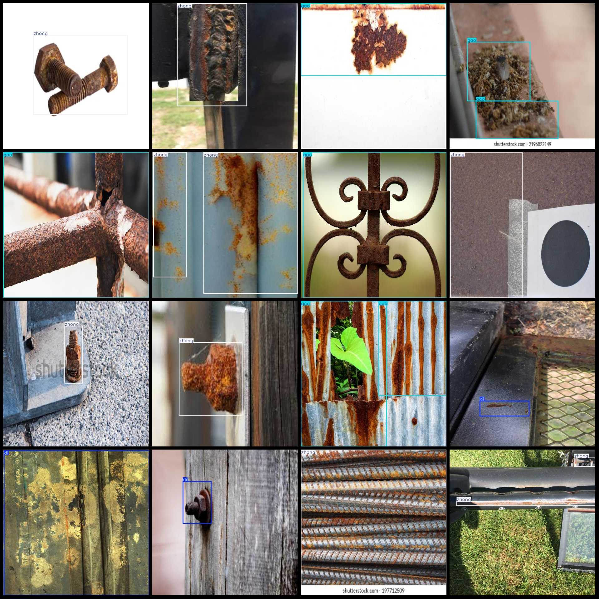

# Metal Corrosion Steel Rotting Severity Rust Scale Test Dataset VOC+YOLO Format with 1134 Images in 3 Categories

Dataset Format: Pascal VOC format + YOLO format (txt files without split paths, only containing jpg images along with corresponding VOC format xml files and yolo format txt files)
Number of Images (jpg file counts): 1134
Number of Annotations (xml file counts): 1134
Number of Annotations (txt file counts): 1134
Number of Category Counts: 3
Annotation Category Names (note that the order of categories in the yolo format does not correspond to this, and should be based on the classes.txt file in the labels folder): ["di", "gao", "zhong"]
Each category has a number of bounding boxes:
- di (low) box count = 506
- gao (high) box count = 971
- zhong (medium) box count = 898
Total box count: 2375
Each category occupies an image count:
- di occupies images = 288
- gao occupies images = 491
- zhong occupies images = 649
Image resolution: 640x640
Labeling Tool Used: labelImg
Annotation Rules: Draw bounding boxes for each category
Important Notice: The dataset does not have any splits for training, validation, or testing; users are required to partition their own datasets.
Special Disclaimer: This dataset does not guarantee the accuracy of the trained models or weight files.
Image Preview:
Annotation Example:

## Images

Here is a pay link on Stripe ( https://buy.stripe.com/3cs8yP7sY87d0vu9AB ). Please contact me lonlonago@foxmail.com after funding $89, and I will send you a complete data files , thank you!

